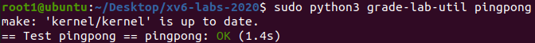
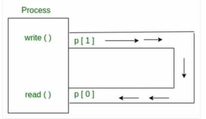
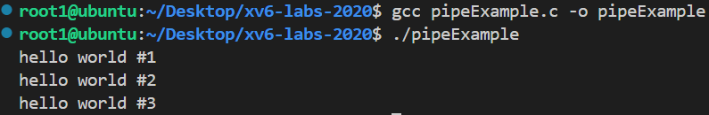
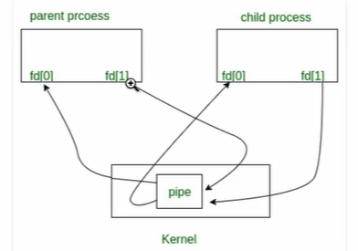

# Lab1: Xv6 and Unix utilities
## 提交注意事项
评测脚本grade-lab-util是python程序，这里对第一行进行修改，将
```python
#!/usr/bin/env python 改为 #!/usr/bin python
```
测试命令由
```bash
./grade-lab-util sleep 改为 sudo python3 grade-lab-util sleep
```
并且在实现对应功能后，需要更新Makefile的UPROGS部分，例如实现了sleep.c后，要在UPROGS处追加：
```
$U/_sleep\
```

## pingpong(easy) 
完成 /user/pingpong.c


### 管道
管道是单向通道，我们可以使用管道，实现一个进程写入管道，另一个进程从管道读取，管道被看做是“虚拟文件”的主内存区域。
当管道中没有数据的时候，进程将挂起，直到有数据被写入。

在C语言语法中：
```c
int pipe(int fds[2]);

参数：
fd[0] 是管道的读端
fd[1] 是管道的写端
返回值 成功是0，错误是-1

完整实例：
#include <unistd.h>
#include <stdio.h>
#include <stdlib.h> 

#define MSGSIZE 16
char* msg1 = "hello world #1";
char* msg2 = "hello world #2";
char* msg3 = "hello world #3";

int main()
{
    char inbuf[MSGSIZE];
    int p[2], i;

    if(pipe(p) < 0) {
        exit(1); // 修正了函数名和添加了分号
    }

    write(p[1], msg1, MSGSIZE);
    write(p[1], msg2, MSGSIZE);
    write(p[1], msg3, MSGSIZE);

    for(i = 0; i < 3; i++) {
        read(p[0], inbuf, MSGSIZE);
        printf("%s\n", inbuf);
    }
    return 0;
}

```


对于使用fork创建的父子进程来说，它们可以共享一个管道，其中父进程的读端是子进程的写端，子进程的读端是父进程的写端。


完整实例：
``` c
#include <unistd.h>
#include <stdio.h>
#include <stdlib.h> 
#include <sys/wait.h>


#define MSGSIZE 16
char* msg1 = "hello world #1";
char* msg2 = "hello world #2";
char* msg3 = "hello world #3";

int main() {
    char inbuf[MSGSIZE];
    int p[2], pid, nbytes;

    if(pipe(p) < 0) {
        exit(1);
    }

    if((pid = fork()) > 0) { // 父进程
        write(p[1], msg1, MSGSIZE);
        write(p[1], msg2, MSGSIZE);
        write(p[1], msg3, MSGSIZE);

        // close(p[1]); r

        wait(NULL);
    } else {
        // close(p[1]);
        while((nbytes = read(p[0], inbuf, MSGSIZE)) > 0) {
            printf("%s %d\n", inbuf, nbytes);
        }
        if(nbytes != 0) {
            exit(2);
        }
        printf("Finished reading\n");
    }
    return 0;
}

输出：
hello world #1 16
hello world #2 16
hello world #3 16
(进程挂起，程序没有终止)

```
子进程在读取完所有数据后，并没有检测到文件描述符 p[1] 已经关闭，而是一直在等待新的数据写入。因为管道的写入端没有关闭，所以子进程会一直阻塞在读取数据的操作上，导致程序无法正常终止，而是陷入了死锁状态。
常见的做法是在父进程写入完数据后关闭写端(父子进程中都要关闭)。
### 实验描述
> 编写一个使用UNIX系统调用的程序来在两个进程之间“ping-pong”一个字节，请使用两个管道，每个方向一个。父进程应该向子进程发送一个字节;子进程应该打印“<pid>:eceived ping”，其中<pid>是进程ID，并在管道中写入字节发送给父进程，然后退出;父级应该从读取从子进程而来的字节，打印“<pid>: received pong”，然后退出。您的解决方案应该在文件user/pingpong.c中。

提示：

- 使用pipe来创造管道
- 使用fork创建子进程
- 使用read从管道中读取数据，并且使用write向管道中写入数据
- 使用getpid获取调用进程的pid
- 将程序加入到Makefile的UPROGS
- xv6上的用户程序有一组有限的可用库函数。您可以在user/user.h中看到可调用的程序列表；源代码（系统调用除外）位于user/ulib.c、user/printf.c和user/umalloc.c中。

运行程序应得到下面的输出
```
$ make qemu
...
init: starting sh
$ pingpong
4: received ping
3: received pong
$
```
